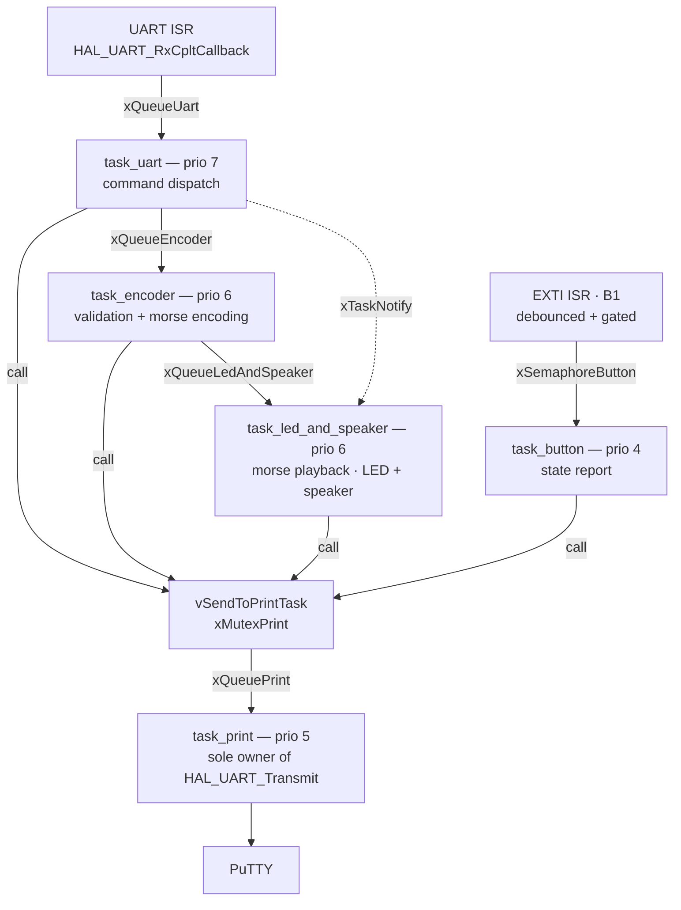

# STM32-MorseStation
 
Embedded C project on a **STM32 Nucleo-F446RE** (Cortex-M4 @ 84 MHz) — FreeRTOS, HAL drivers, STM32CubeIDE.
 
Control a complete morse code station over UART: authenticate, send a message, it encodes and plays it on LEDs and a speaker following ITU-R timing, and loops until a new one arrives.

---

## Demo

> 📹 *Video demonstration*


https://github.com/user-attachments/assets/aa34e936-acd7-4dce-8733-3125123319fb


> 📐 *Schematic*


---

## What it does

| Feature | Description |
|---------|-------------|
| Power gate | System refuses all input until `ON` is received |
| Authentication | Login / password loop before any command is accepted |
| Speed control | `#SPEED <ms>` adjusts unit duration at runtime, mutex-protected |
| Morse encoding | Any alphanumeric string encoded to standard morse |
| Morse playback | LEDs and speaker toggle following ITU-R morse timing |
| Message loop | Last message plays on repeat until a new one arrives |
| Live preemption | `xTaskNotify` triggers buffer reload at end of current cycle |
| State report | B1 press prints speed and last 3 messages over UART |
| Debounce | ISR-level software debounce — ignores presses within 50ms |
| Historic | Last 3 messages stored in `gState.HISTORIC`, circular buffer |
| Error handling | Invalid chars, queue overflow, command size limit |

---

## Hardware

| Component | Pin | Role |
|-----------|-----|------|
| USART2 TX | PA2 | UART transmit to PC |
| USART2 RX | PA3 | UART receive from PC |
| Red LED | PC4 | System OFF indicator |
| Green LED 1 | PA6 | System ON indicator |
| Green LED 2 | PA7 | Logged indicator |
| Blue LED | PB0 | Morse playback indicator |
| Speaker | PC1 | Morse audio output |
| B1 button | PC13 | State report trigger (EXTI falling edge) |

---

## File structure

```
Core/
├── Inc/
│   ├── globals_var.h              # All extern declarations, types, FreeRTOS primitives
│   ├── utils.h                    # vSendToPrintTask() interface
│   ├── task_uart.h
│   ├── task_print.h
│   ├── task_encoder.h
│   ├── task_led_and_speaker.h
│   └── task_button.h              # DEBOUNCE_DELAY, last_press_tick extern
└── Src/
    ├── main.c                     # HAL init, FreeRTOS primitives, task launch
    ├── globals_var.c              # Single definition of all global variables
    ├── utils.c                    # vSendToPrintTask() implementation
    ├── task_uart.c                # UART ISR, power gate, auth, command dispatch
    ├── task_print.c               # Serialized UART transmission
    ├── task_encoder.c             # Input validation + morse encoding pipeline
    ├── task_led_and_speaker.c     # Morse playback on LEDs and speaker
    └── task_button.c              # EXTI ISR, debounce, state report
```

---

## UART Commands
 
```
> ON
LOGIN:    > admin
PASSWORD: > 1234
SUCCESSFULLY LOGGED!
 
> HELLO WORLD       → encodes and plays in morse
> #SPEED 100        → sets unit duration to 100ms
> OFF               → full system reset (NVIC)
```
 
Pressing **B1** prints current state without side effects:
```
SPEED = 100
TRANSMIT HISTORIC =
HELLO WORLD
SOS
42
```
 
---

## Architecture

The system is built around a **pipeline of 5 FreeRTOS tasks** communicating exclusively through queues, mutexes and semaphores. No shared memory is accessed without synchronization.



### Task priority map

| Task | Priority | Role |
|------|----------|------|
| `task_uart` | 7 | Command dispatch, pipeline driver |
| `task_encoder` | 6 | Input validation + morse encoding |
| `task_led_and_speaker` | 6 | Morse playback on hardware |
| `task_print` | 5 | Serializes all UART transmissions |
| `task_button` | 4 — lowest | Reports system state on press |

---

## Key design decisions
 
**Centralized UART output** — `task_print` is the only task that calls `HAL_UART_Transmit`. All others push bytes into `xQueuePrint` under `xMutexPrint` via `vSendToPrintTask()`, preventing any interleaving.
 
**Interrupt-driven UART** — The ISR pushes one byte into `xQueueUart` and immediately re-arms itself. Queue overflow is flagged and handled gracefully on the next cycle.
 
**Non-blocking message loop** — `task_led_and_speaker` checks for a new message via `xTaskNotifyWait` with zero timeout after each full cycle. Transition is seamless — no mid-symbol interruption.
 
**Stack sizing** — Measured with `uxTaskGetStackHighWaterMark()`, sized to peak consumption + 30-word safety margin. Overflow detection via `configCHECK_FOR_STACK_OVERFLOW 2`.
 
**Global state** — All shared state in a single `state_t` struct (`gState`), mutex-protected on every access.
 
---

*Follows [STM32-LedControl](../STM32-LedControl/README.md) — bare HAL project covering timers, interrupt-driven UART, ISR flag pattern, debounce and state machine.*
